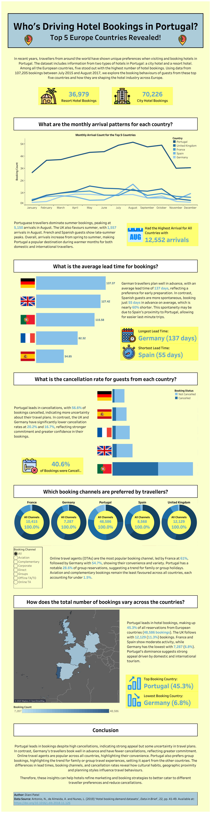

# Who’s Driving Hotel Bookings in Portugal?

A Tableau dashboard exploring the top 5 European countries booking hotels in Portugal, with insights into booking habits, lead times, cancellation rates, and more.

---

## Overview
This dashboard analyses over 107,000 hotel bookings (2015–2017) across city and resort hotels in Portugal. It focuses on the top 5 booking countries in Europe and reveals unique patterns in travel behavior.

## Tools Used
- Tableau Public
- Excel (for data cleaning)

## Key Insights
- August is the peak month for all top 5 countries, especially Portugal.
- Germans book furthest in advance (137 days), Spaniards the latest (55 days).
- Portugal has the highest cancellation rate (40.6%).
- Online Travel Agents are the most popular booking channel across all countries.

## Live Dashboard
[View on Tableau Public](https://public.tableau.com/app/profile/diani.patel/viz/WhichTop5CountriesHavetheMostSignificantHotelBookingTrendsinEurope/NewDashboard)

## Preview

